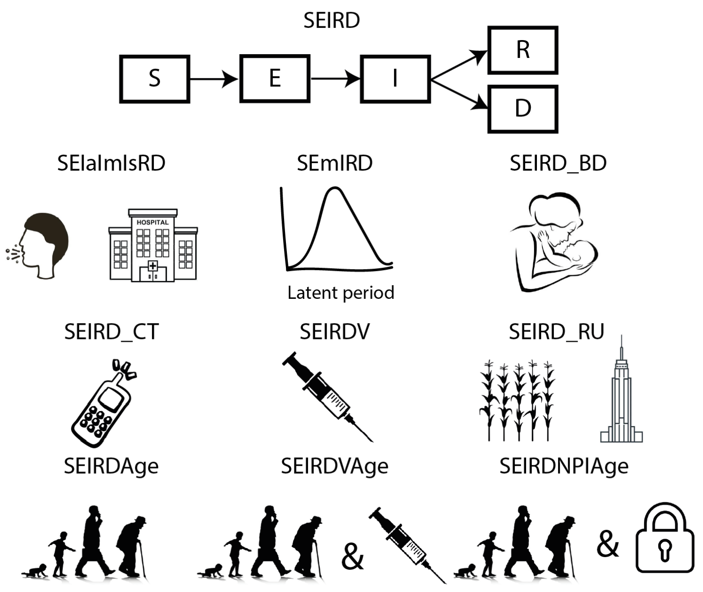

<!-- README.md is generated from README.Rmd. Please edit that file -->

```{r, include = FALSE}
knitr::opts_chunk$set(
  collapse = TRUE,
  comment = "#>",
  fig.path = "man/figures/README-",
  out.width = "100%"
)
```

# comomodels

<!-- badges: start -->
[](https://codecov.io/gh/Como-DTC-Collaboration/como-models)
<!-- badges: end -->

The goal of `comomodels` is to provide pedagogical materials, chiefly a series of transmission dynamics models of increasing complexity, for understanding the spread of COVID-19. The Susceptible-Exposed-Infectious-Recovered-Dead (SEIRD) model is the basis of all the models included in the package. The SEIRD model is extended to model different age groups, groups of varying infectiousness, vaccination, distinct meta-populations amongst other areas. The schematic figure below shows the various models in the `comomodels` package. 



The currently available models include:

1. `SEIRD` model.  
2. `SEIaImIsRD` model - an SEIRD model with groups of varying infectiousness. Here, we include asymptomatic, mildly symptomatic and severely ill groups.  
3. `SEIRDV` model - an SEIRD model including vaccinated compartments. 
4. `SEIRD_BD` model - an SEIRD model including births and natural deaths and waning natural immunity.
5. `SEIRD_RU` model - two linked SEIRD models used to represent two meta-populations, which here we label (and parameterise) as rural and urban populations.  
6. `SEIRDAge` model - an SEIRD model stratified by age, allowing intermixing across ages.
7. `SEIRDVAge` model - an age-stratified SEIRD model allowing vaccination of different age groups.  
8. `SEIRDNPIAge` model - an SEIRD model accounting for non-pharmaceutical interventions, such as self-isolation.

## Installation

The development version of `comomodels` can be installed from [GitHub](https://github.com/) with:

``` r
# install.packages("devtools")
devtools::install_github("Como-DTC-Collaboration/como-models")
```

## Example

There are a series of vignettes, available [here](https://github.com/Como-DTC-Collaboration/como-models/tree/main/vignettes), which each provide tutorials for a given model. 

