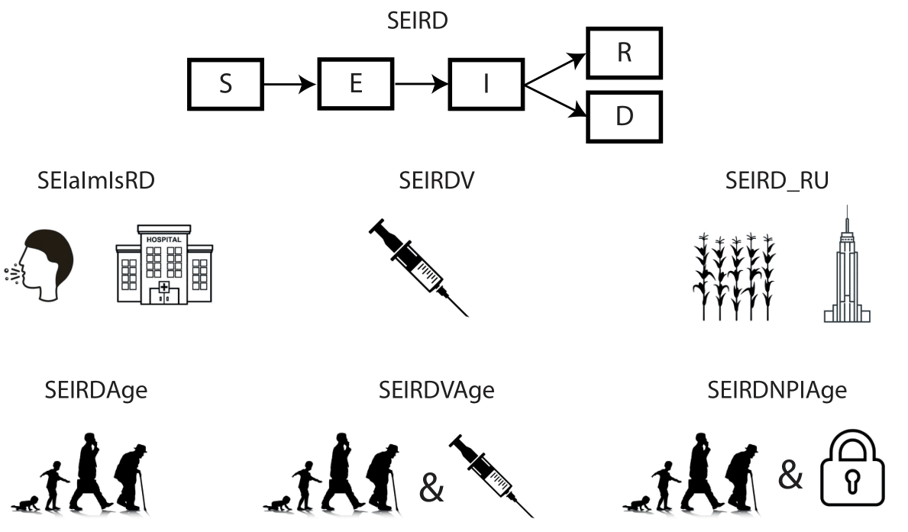

<!-- README.md is generated from README.Rmd. Please edit that file -->

# comomodels

<!-- badges: start -->

[](https://codecov.io/gh/Como-DTC-Collaboration/como-models)
<!-- badges: end -->

The goal of `comomodels` is to provide pedagogical material for the
understanding of transmission dynamics modelling based on compartmental
models. The Susceptible-Exposed-Infectious-Recovered-Dead (SEIRD) model
is the basis of all the models included in the package. The SEIRD model
is extended to model different age groups, varying infectiousness,
vaccination, meta-populations and others. The schematic figure below
shows the various models in the `comomodels` package.



The list of available models are:

1.  SEIRD model.  
2.  SEIaImIsRD model - SEIRD model with varying infectiousness,
    i.e. asymptomatic, mildly symptomatic and severely symptomatic.  
3.  SEIRDV model - SEIRD model with vaccination.  
4.  SEIRD\_RU model - SEIRD model with two meta-populations, i.e. rural
    and urban population.  
5.  SEIRDAge model - SEIRD model with different age groups.  
6.  SEIRDVAge model - SEIRD model with vaccination and different age
    groups.  
7.  SEIRDNPIAge model - SEIRD model with non-pharmaceutical
    intervention, e.g. isolation.

## Installation

The development version of `comomodels` can be installed from
[GitHub](https://github.com/) with:

``` r
# install.packages("devtools")
devtools::install_github("Como-DTC-Collaboration/como-models")
```

## Example

There are a series of vignettes, available here:
<https://github.com/Como-DTC-Collaboration/como-models/tree/main/vignettes>,
which provide tutorials for each models.
