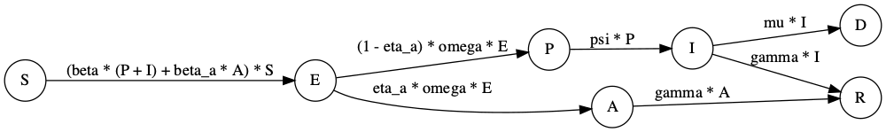

```{r, include = FALSE}
knitr::opts_chunk$set(
  collapse = TRUE,
  comment = "#>"
)
```

# Introduction
Contact tracing, testing and isolation are key elements of many governments' responses to the COVID-19 pandemic. Some have suggested that well-executed programmes for testing and tracing and quarantining of affected individuals explains how some countries, noticeably some in East Asia, have successfully dealt with the pandemic [@cohen2020countries].

In this article, we introduce a model that extends the SEIRD model (see `Vignette("SEIRD")`) which can be used to investigate the importance of this type of non-pharmaceutial intervention.

Since a sizeable proportion of transmission is thought to happen before symptoms occur [@he2020temporal], we include a presymptomatic compartment, $P$, which contributes to infectious. Now the "infectious" compartment, $I$, represents the symptomatic and infectious individuals.

Although estimates of the importance of asymptomatic individuals to transmission vary widely, there is consensus that they are important reservoirs of transmission [@byambasuren2020estimating]. Because of this, we also include an asymptomatic compartment, $A$, in this model.

The model we assume without any interventions in place has the following structure.


```{r, echo=FALSE, warning=FALSE, out.width = "800px"}
# library(DiagrammeR)
# library(DiagrammeRsvg)
# library(webshot)
# library(rsvg)
# g <- grViz("
# digraph PrimC{
#   graph [rankdir = 'LR']
#   node [shape = circle]
#   S E P I A R
#   S -> E [label = '(beta * (P + I) + beta_a * A) * S']
#   E -> P [label = '(1 - eta_a) * omega * E']
#   E -> A [label = 'eta_a * omega * E']
#   P -> I [label = 'psi * P']
#   I -> R [label = 'gamma * I']
#   A -> R [label = 'gamma * A']
#   I -> D [label = 'mu * I']
#   }")
# tmp = DiagrammeRsvg::export_svg(g)
# tmp = charToRaw(tmp)
# rsvg::rsvg_png(tmp, "images/seird_ct.png", width = 1000)

```

In this model, the new parameters from the basic SEIRD are $0\leq \eta_a \leq 1$ is the proportion of asymptomatic cases; $1/\omega$ is the typical latent period; $1/\psi$ is the typical time spent transmitting presymptomatically.

We now extend this model to include tracing and isolation. The model assumes that a proportion, $0\leq \phi \leq 1$ of individuals successfully self-isolate when their symptoms appear, spawning no further transmission. It also assumes that a proportion of infected individuals, $0\leq \chi \leq 1$, who have been traced as contacts of symptomatic infected individuals also successfully isolate. The overall system of ODEs then has the following form:

\begin{align}
\frac{\text{d}S}{\text{d}t} &= - (\beta (P + I) + \beta_a A) S,\\
\frac{\text{d}E}{\text{d}t} &= \beta (1 - \chi) (P + I) S + \beta_a A S - \omega E,\\
\frac{\text{d}P}{\text{d}t} &= (1 - \eta_a) \omega E - \psi P,\\
\frac{\text{d}A}{\text{d}t} &= \eta_a \omega E - \gamma A,\\
\frac{\text{d}I}{\text{d}t} &= (1 - \phi) \psi P - (\gamma + \mu) I,\\
\frac{\text{d}E^T}{\text{d}t} &= \beta \chi (P + I) S - \omega E^T,\\
\frac{\text{d}P^T}{\text{d}t} &= (1 - \eta_a) \omega E^T - \psi P^T,\\
\frac{\text{d}A^T}{\text{d}t} &= \eta_a \omega E^T - \gamma A^T,\\
\frac{\text{d}I^T}{\text{d}t} &= \psi P^T + \phi \psi P - (\gamma + \mu) I^T,\\
\frac{\text{d}R}{\text{d}t} &= \gamma (I + I^T + A + A^T),\\
\frac{\text{d}D}{\text{d}t} &= \mu (I + I^T).
\end{align}

An alternative way of understanding this model structure is to visualise it.

```{r, out.width = "800px"}
# create model object
model <- SEIRD_CT()

# visualise structure
ode_structure_diagram(model)
```

Effectively, this model has two parallel tracts, which are copies of the first model in this vignette: one representing unisolated individuals (i.e. those compartments without the "T") and those representing quarantining individuals (with a "T"). There are two flows into the quarantined tract: susceptibles can be isolated upon infection $S\rightarrow E^T$ if they are known contacts of an individual who goes on to be symptomatic: i.e. either $P$ or $I$; or infected individuals can be quarantined once they become symptomatic $P\rightarrow I^T$.

## Basic reproduction number
It can be shown that the basic reproduction number for this model is given by^[Following [@vandenDriessche17] (see `Vignette("SEIaImIsRD")` for more information) and assuming a state order: $(E, P, A, I, E^T, P^T, A^T, I^T)$, we obtain the matrices:
$$
F = \left(\begin{array}{cc} 
0 & \beta (1-\chi) & \beta_a & \beta (1-\chi) & 0 & 0 & 0 & 0\\
0 & 0 & 0 & 0 & 0 & 0 & 0 & 0\\
0 & 0 & 0 & 0 & 0 & 0 & 0 & 0\\
0 & 0 & 0 & 0 & 0 & 0 & 0 & 0\\
0 & \beta \chi & 0 & \beta \chi & 0 & 0 & 0 & 0\\
0 & 0 & 0 & 0 & 0 & 0 & 0 & 0\\
0 & 0 & 0 & 0 & 0 & 0 & 0 & 0\\
0 & 0 & 0 & 0 & 0 & 0 & 0 & 0
\end{array}\right),
$$
and
$$
V = \left(\begin{array}{cc} 
\omega & 0 & 0 & 0 & 0 & 0 & 0 & 0\\
-(1-\eta_a)\omega & \psi & 0 & 0 & 0 & 0 & 0 & 0\\
-\eta_a\omega & 0 & \gamma & 0 & 0 & 0 & 0 & 0\\
0 & -(1-\phi)\psi & 0 & \gamma+\mu & 0 & 0 & 0 & 0\\
0 & 0 & 0 & 0 & \omega & 0 & 0 & 0\\
0 & 0 & 0 & 0 & -(1-\eta_a)\omega & \psi & 0 & 0\\
0 & 0 & 0 & 0 & -\eta_a\omega & 0 & \gamma & 0\\
0 & -\phi\psi & 0 & 0 & 0 & -\psi & 0 & \gamma+\mu
\end{array}\right)
$$
The matrix $K=FV^{-1}$ is called the next generation matrix and the maximum absolute eigenvalue of it yields the basic reproduction number given in the main text.
]:

\begin{equation}
R_0 = \eta_a\underbrace{\frac{\beta_a}{\gamma}}_{\text{asymptomatic cases}} + (1 - \eta_a)(1 - \chi) \left[\underbrace{\frac{\beta}{\psi}}_{\text{presymptomatic cases}} + (1-\phi) \underbrace{\frac{\beta}{\gamma+\mu}}_{\text{symptomatic cases}}\right].
\end{equation}

As the underbraces show in the equation above, this expression has ample intuition behind it. The average number of cases generated from a given infection equates to the sum of: the average cases generated if the infection were asymptomatic, weighted by the probability of a case being asymptomatic; the average number of cases from presymptomatics which are the overall cases which are not asymptomatic $(1-\eta_a)$ which are not quarantined due to contact tracing $(1-\chi)$; and those generated from symptomatics for the same overall fraction of cases $(1-\eta_a)(1-\chi)$ and who do not self isolate when their symptoms start $(1-\phi)$.

The expression for $R_0$ shows that even if contact tracing and isolation of contacts is perfect ($\chi=1$), there remains transmission due solely to asymptomatic cases. A meta-analysis concluded that the overall proportion of cases due to asymptomatics is 17% [@byambasuren2020estimating], meaning that if the transmission rate of asymptomaics, $\beta_a$ is high enough (or, although this model does not include it, a longer duration of infection), it is possible to sustain an epidemic solely through asymptomatic transmission: if $\eta \beta_a/\gamma>1$. This analysis suggests that regular testing, regardless of whether an individual has symptoms, may be an effective way to target asymptomatic reservoirs of infection, if upon testing positive individuals and their close contacts isolate.

What does the expression for $R_0$ suggest about the relevant importance of self isolation of symptomatic individuals versus isolation of contacts of symptomatic individuals? It indicates that the former is much less important than the latter, because self isolation upon being symptomatic only prevents those cases generated by that person whilst they are symptomatic (and they may already have transmitted whilst they were asymptomatic). Whereas if contacts of symptomatic individuals are quarantined, this prevents both presymtpomatic and symptomatic transmission from their contacts. However, it is likely much harder to effectively contact trace individuals and to get these individuals to quarantine than it is to enforce self isolation upon becoming symptomatic.

## Contact tracing and isolation for ancestral SARS-CoV-2, and the Delta and Omicron variants
We now compare the utility of these NPIs for containing COVID-19 transmission. For ancestral SARS-CoV-2, an average duration of presymptomatic infectiousness was estimated as 3 days [@he2020temporal], representing roughly 55% of the latent period [@Xin21]. Whilst this is a rough assumption, lacking data, we assume the same fraction of the latent period represents presymptomatic infectiousness for the Delta and Omicron variants. 

We assume that 17% of cases are asymptomatic: meaning $\eta_a=0.17$ [@byambasuren2020estimating]. A meta-analysis attempting to determine the relative infectiousness of asymptomatic cases versus symptomatic found estimates in the literature ranging from 0 to 1 [@mcevoy2021relative], however, some of the studies they analysed had only a handful of estimates. A study of an outbreak of COVID-19 in marine recruits used qPCR as a proxy for viral load and found that it was approximately four times higher in symptomatic opposed to asymptomatic carries [@letizia2020sars], as such, we set $\beta_a=0.25\beta$.

We first find transmission parameters across all variants assuming that no NPIs are in place. Note, this requires us to find beta values which match given $R_0$ values for each variant, which we do via optimisation (through `optim`).

```{r setup}
library(comomodels)
library(tidyverse)

# helper functions
R0_calculator <- function(beta, gamma, mu, chi, phi, omega, eta_a, psi) {
  model <- SEIRD_CT()
  params <- list(beta=beta,
                 beta_a=0.25 * beta,
                 gamma=gamma,
                 mu=mu,
                 chi=chi,
                 phi=phi,
                 omega=omega,
                 eta_a=eta_a,
                 psi=psi)
  transmission_parameters(model) <- params
  R0(model)
}
find_beta <- function(R0_target, gamma, mu, chi, phi, omega, eta_a, psi){
  f_beta <- function(beta) {
    R0_test <- R0_calculator(beta, gamma, mu, chi, phi, omega, eta_a, psi)
    abs(R0_test - R0_target)
  }
  
  # minimise difference between target and actual R0
  optim(1, f_beta)$par
}

# parameters assumed same across all variants
chi <- 0
phi <- 0
eta_a <- 0.17
inits <- list(
  S0=0.999, E0=0, P0=0, A0=0, I0=0.001,
  Et0=0, Pt0=0, At0=0, It0=0, R0=0)

# ancestral
params <- covid_transmission_parameters()
kappa <- params$kappa
latent_period <- 1 / kappa
presymptomatic_period <- 3
psi <- 1 / presymptomatic_period
omega <- 1 / (latent_period - presymptomatic_period)
fraction_infectious <- presymptomatic_period / latent_period
gamma <- params$gamma
mu <- params$mu
R0_target <- params$R0
beta <- find_beta(R0_target, gamma, mu, chi, phi, omega, eta_a, psi)
beta_a <- 0.25 * beta
params_ancestral <- list(beta=beta,
               beta_a=beta_a,
               gamma=gamma,
               mu=mu,
               chi=chi,
               phi=phi,
               omega=omega,
               eta_a=eta_a,
               psi=psi)

# gets parameters for a variant
get_parameters_variant <- function(variant_name) {
    params <- covid_transmission_parameters(variant=variant_name)
  kappa <- params$kappa
  latent_period <- 1 / kappa
  # assumes same fraction presymptomatic as for ancestral
  presymptomatic_period <- latent_period * fraction_infectious
  psi <- 1 / presymptomatic_period
  omega <- 1 / (latent_period - presymptomatic_period)
  gamma <- params$gamma
  mu <- params$mu
  R0_target <- params$R0
  beta <- find_beta(R0_target, gamma, mu, chi, phi, omega, eta_a, psi)
  beta_a <- 0.25 * beta
  
  model <- SEIRD_CT()
  params <- list(beta=beta,
                 beta_a=beta_a,
                 gamma=gamma,
                 mu=mu,
                 chi=chi,
                 phi=phi,
                 omega=omega,
                 eta_a=eta_a,
                 psi=psi)
  params
}

params_delta <- get_parameters_variant("delta")
params_omicron <- get_parameters_variant("omicron")
```

Now we run the `SEIRD_CT` model for each of the variants. We compare a number of scenarios: a base scenario where we do nothing; a "self isolation" scenario where self isolation upon becoming symptomatic is the only NPI in place, and that 50% of people follow this: $\chi=0$ and $\phi=0.5$; a "contact tracing scenario" where 50% of symptomatic individuals have their contacts traced and all these isolate: $\chi=0.5$ and $\phi=0.0$; and a scenario where we do implement both of the aforementioned NPIs. Note, reaching 50% of symptomatic individuals and getting all of their contacts to isolate is likely unrealistic, but we keep this figure here to directly compare this NPI with self isolation only.

```{r, fig.height = 5, fig.width = 7}
# helper functions to run model for all variants
run_model <- function(chi, phi, params, inits, times=seq(0, 365, 1)) {
  model <- SEIRD_CT()
  params$chi <- chi
  params$phi <- phi
  transmission_parameters(model) <- params
  initial_conditions(model) <- inits
  outputs <- run(model, times)
  outputs$changes
}

run_all_variants <- function(chi, phi, scenario) {
  changes_ancestral <- run_model(
    chi=chi, phi=phi, params_ancestral, inits) %>% 
    mutate(variant="ancestral") %>% 
    mutate(scenario=scenario)
  changes_delta <- run_model(
    chi=chi, phi=phi, params_delta, inits) %>% 
    mutate(variant="Delta") %>% 
    mutate(scenario=scenario)
  changes_omicron <- run_model(
    chi=chi, phi=phi, params_omicron, inits) %>% 
    mutate(variant="Omicron") %>% 
    mutate(scenario=scenario)
  changes_ancestral %>% 
    bind_rows(changes_delta) %>% 
    bind_rows(changes_omicron)
}

# different policy mixes
policies <- c("do nothing",
              "self isolation",
              "contact tracing",
              "self isolation \n+ contact tracing")
policy_parameters <- tibble(policy=policies) %>% 
  mutate(chi=c(0, 0, 0.5, 0.5),
         phi=c(0, 0.5, 0, 0.5))

# run all models
for(i in seq_along(policies)) {
 changes <- run_all_variants(
   policy_parameters$chi[i],
   policy_parameters$phi[i],
   policy_parameters$policy[i])
 if(i == 1) {
   big_df <- changes
 } else{
   big_df <- big_df %>% bind_rows(changes)
 }
}

# plot
big_df %>%  
  mutate(scenario=fct_relevel(scenario, policies)) %>% 
  dplyr::filter(compartment=="Incidence") %>% 
  ggplot(aes(x=time, y=value)) +
  geom_line() +
  facet_grid(vars(variant), vars(scenario)) +
  xlab("time (days)") +
  ylab("case fraction")
```

From the above plot, it is evident that the contact tracing scenario is more effective at reducing the peak case load than the self isolation scenario, and that implementing both of these NPIs has an even greater impact. For ancestral COVID-19, indeed, it appears that the scenario where both of these are implemented is sufficient to avoid an epidemic altogether. For Delta and Omicron, however, epidemics are diminished although remain -- for these variants, the transmission rate is so high that even the unrealistically effective NPI policies we consider cannot quash transmission alone.

Comparing the R0 values under these policies, the results above are explicated: an epidemic can only be avoided for the ancestral strain when both NPIs are in place.

```{r, fig.height = 5, fig.width = 7}
# helper functions to find R0
find_R0 <- function(chi, phi, params) {
  model <- SEIRD_CT()
  params$chi <- chi
  params$phi <- phi
  transmission_parameters(model) <- params
  R0(model)
}

find_R0_all_variants <- function(chi, phi) {
  R0_ancestral <- find_R0(chi, phi, params_ancestral)
  R0_delta <- find_R0(chi, phi, params_delta)
  R0_omicron <- find_R0(chi, phi, params_omicron)
  tibble(
    ancestral=R0_ancestral,
    Delta=R0_delta,
    Omicron=R0_omicron)
}

# calculate R0s
for(i in seq_along(policy_parameters$policy)) {
  temp_df <- find_R0_all_variants(
    chi=policy_parameters$chi[i],
    phi=policy_parameters$phi[i]) %>% 
    mutate(scenario=policy_parameters$policy[i])
  if(i == 1)
    big_df <- temp_df
  else
    big_df <- big_df %>% bind_rows(temp_df)
}

# plot
big_df %>% 
  mutate(scenario=fct_relevel(scenario, policies)) %>% 
  pivot_longer(ancestral:Omicron) %>% 
  mutate(variant=name) %>% 
  ggplot(aes(x=scenario, y=value)) +
  geom_col() +
  geom_hline(yintercept = 1, linetype=2,
             colour="orange") +
  ylab("R0") +
  coord_flip() +
  facet_wrap(~variant, scales="free")
```

## References