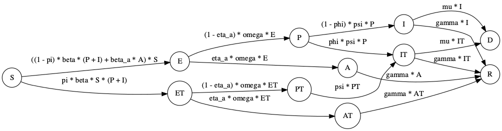

```{r, include = FALSE}
knitr::opts_chunk$set(
  collapse = TRUE,
  comment = "#>"
)
```

```{r setup}
library(comomodels)
```

# Introduction
Contact tracing, testing and isolation are key elements of many governments' responses to the COVID-19 pandemic. Some have suggested that well-executed programmes for testing and tracing and quarantining of affected individuals explains how some countries, noticeably some in East Asia, have successfully dealt with the pandemic [@cohen2020countries].

In this article, we introduce a model that extends the SEIRD model (see `Vignette("SEIRD")`) which can be used to investigate the importance of this type of non-pharmaceutial intervention.

Since a sizeable proportion of transmission is thought to happen before symptoms occur [@he2020temporal], we include a presymptomatic compartment, $P$, which contributes to infectious. Now the "infectious" compartment, $I$, represents the symptomatic and infectious individuals.

Although estimates of the importance of asymptomatic individuals to transmission vary widely, there is consensus that they are important reservoirs of transmission [@byambasuren2020estimating]. Because of this, we also include an asymptomatic compartment, $A$, in this model.

The model we assume without any interventions in place has the following structure.


```{r, echo=FALSE, warning=FALSE, out.width = "400px"}
# library(DiagrammeR)
# library(DiagrammeRsvg)
# library(webshot)
# library(rsvg)
# g <- grViz("
# digraph PrimC{
#   graph [rankdir = 'LR']
#   node [shape = circle]
#   S E P I A R
#   S -> E [label = '&#946; * S * I']
#   E -> P [label = '(1 - eta_a) * omega * E']
#   E -> A [label = 'eta_a * omega * E']
#   P -> I [label = 'psi * P']
#   I -> R [label = 'gamma * I']
#   A -> R [label = 'gamma * A']
#   I -> D [label = 'mu * I']
#   }")
# tmp = DiagrammeRsvg::export_svg(g)
# tmp = charToRaw(tmp)
# rsvg::rsvg_png(tmp, "images/seird_ct.png", width = 1000)
knitr::include_graphics("images/seird_ct.png")
```

In this model, the new parameters from the basic SEIRD are $0\leq \eta_a \leq 1$ is the proportion of asymptomatic cases; $1/\omega$ is the typical latent period; $1/\psi$ is the typical time spent transmitting presymptomatically.

We now extend this model to include tracing and isolation. The model assumes that a proportion, $0\leq \phi \leq 1$ of individuals successfully self-isolate when their symptoms appear, spawning no further transmission. It also assumes that a proportion of infected individuals, $0\leq \pi \leq 1$, who have been traced as contacts of infected individuals also successfully isolate. The overall system of ODEs then has the following form:

\begin{align}
\frac{\text{d}S}{\text{d}t} &= - (\beta (P + I) + \beta_a A) S,\\
\frac{\text{d}E}{\text{d}t} &= \beta (1 - \pi) (P + I) S + \beta_a A S - \omega E,\\
\frac{\text{d}P}{\text{d}t} &= (1 - \eta_a) \omega E - \psi P,\\
\frac{\text{d}A}{\text{d}t} &= \eta_a \omega E - \gamma A,\\
\frac{\text{d}I}{\text{d}t} &= (1 - \phi) \psi P - (\gamma + \mu) I,\\
\frac{\text{d}E^T}{\text{d}t} &= \beta \pi (P + I) S - \omega E^T,\\
\frac{\text{d}P^T}{\text{d}t} &= (1 - \eta_a) \omega E^T - \psi P^T,\\
\frac{\text{d}A^T}{\text{d}t} &= \eta_a \omega E^T - \gamma A^T,\\
\frac{\text{d}I^T}{\text{d}t} &= \psi P^T + \phi \psi P - (\gamma + \mu) I^T,\\
\frac{\text{d}R}{\text{d}t} &= \gamma (I + I^T + A + A^T),\\
\frac{\text{d}D}{\text{d}t} &= (\gamma + \mu) * (I + I^T).
\end{align}

An alternative way of understanding this model structure is to visualise it.

```{r, echo=FALSE, warning=FALSE, out.width = "400px"}
# library(DiagrammeR)
# library(DiagrammeRsvg)
# library(webshot)
# library(rsvg)
# g <- grViz("
# digraph PrimC{
#   graph [rankdir = 'LR']
#   node [shape = circle]
#   S E P I A ET PT IT AT R
#   S -> E [label = '&#946; * (1 - pi) * S * I']
#   E -> P [label = '(1 - eta_a) * omega * E']
#   E -> A [label = 'eta_a * omega * E']
#   P -> I [label = '(1 - phi) * psi * P']
#   I -> R [label = 'gamma * I']
#   A -> R [label = 'gamma * A']
#   S -> ET [label = '&#946; * pi * S * I']
#   ET -> PT [label = '(1 - eta_a) * omega * ET']
#   PT -> IT [label = 'psi * PT']
#   P -> IT [label = 'phi * psi * P']
#   ET -> AT [label = 'eta_a * omega * ET']
#   I -> D [label = 'mu * I']
#   IT -> D [label = 'mu * IT']
#   IT -> R [label = 'gamma * IT']
#   AT -> R [label = 'gamma * AT']
#   }")
# tmp = DiagrammeRsvg::export_svg(g)
# tmp = charToRaw(tmp)
# rsvg::rsvg_png(tmp, "images/seird_ct_full.png", width = 1000)

```

Effectively, this model has two parallel tracts, which are copies of the first model in this vignette: one representing unisolated individuals (i.e. those compartments without the "T") and those representing quarantining individuals (with a "T"). There are two flows into the quarantined tract: susceptibles can be isolated upon infection $S\rightarrow E^T$ if they are known contacts of an infected individual; or infected individuals can be quarantined once they become symptomatic $P\rightarrow I^T$.

## References